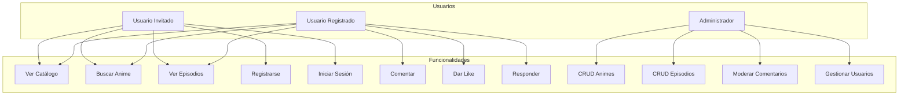
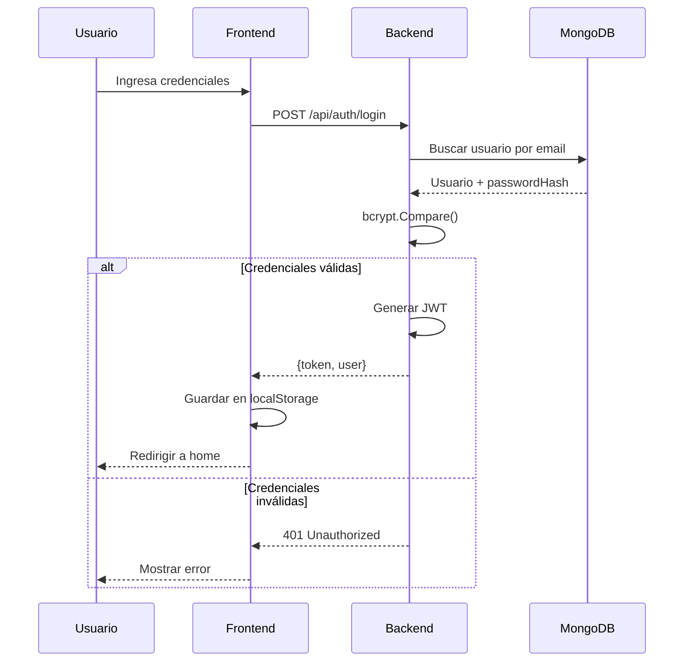
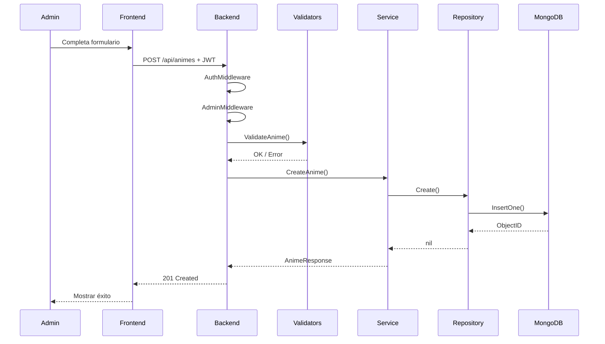
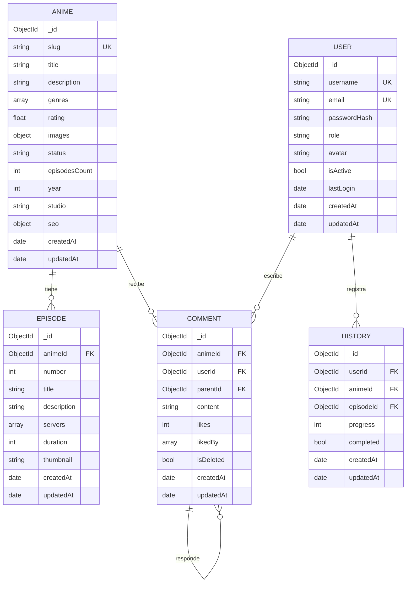
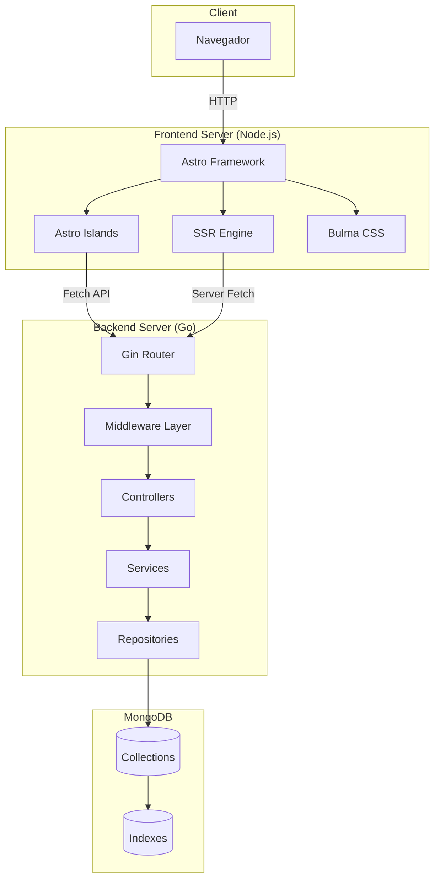
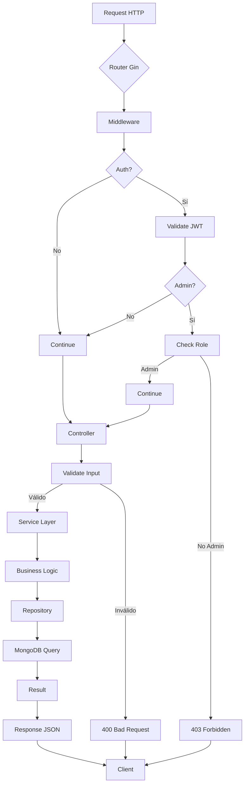

# 📊 Diagramas del Sistema

## Diagrama de Casos de Uso



## Diagrama de Flujo - Autenticación



## Diagrama de Flujo - Crear Anime



## Diagrama NoSQL - Modelo de Datos



## Diagrama de Arquitectura General



## Flujo Backend Detallado



## Wireframes - Páginas Principales

### Home
```
┌─────────────────────────────────────┐
│  🎬 AnimeStream    [Inicio][Catálogo][Buscar] [Login] │
├─────────────────────────────────────┤
│                                     │
│     Descubre tu próximo anime       │
│     [Explorar Catálogo] [Buscar]    │
│                                     │
├─────────────────────────────────────┤
│  📺 Últimos Agregados    [Ver Todo] │
│  ┌────┐ ┌────┐ ┌────┐ ┌────┐       │
│  │Img │ │Img │ │Img │ │Img │       │
│  │Tit │ │Tit │ │Tit │ │Tit │       │
│  └────┘ └────┘ └────┘ └────┘       │
├─────────────────────────────────────┤
│  ⭐ Mejor Valorados                 │
│  ┌────┐ ┌────┐ ┌────┐ ┌────┐       │
│  │Img │ │Img │ │Img │ │Img │       │
│  │Tit │ │Tit │ │Tit │ │Tit │       │
│  └────┘ └────┘ └────┘ └────┘       │
├─────────────────────────────────────┤
│  Footer                             │
└─────────────────────────────────────┘
```

### Anime Detail
```
┌─────────────────────────────────────┐
│  Navbar...                          │
├─────────────────────────────────────┤
│  ┌────────┐  Título del Anime       │
│  │        │  [En Emisión] [⭐9.1]   │
│  │ Poster │  Descripción...         │
│  │        │  [Acción] [Aventura]    │
│  └────────┘                         │
├─────────────────────────────────────┤
│  📺 Episodios                       │
│  ┌─────────────────────────────┐    │
│  │ #1  Título Episodio    [▶]  │    │
│  │ #2  Título Episodio    [▶]  │    │
│  └─────────────────────────────┘    │
├─────────────────────────────────────┤
│  💬 Comentarios                     │
│  [Escribe tu comentario...] [Enviar]│
│  ┌─────────────────────────────┐    │
│  │ 👤 Usuario - fecha          │    │
│  │ Contenido del comentario    │    │
│  │ [👍5] [💬 Responder]        │    │
│  └─────────────────────────────┘    │
└─────────────────────────────────────┘
```

### Admin Dashboard
```
┌─────────────────────────────────────┐
│ [Sidebar]     │  Dashboard          │
│               │  ┌──┐ ┌──┐ ┌──┐ ┌──┐│
│ 📊 Dashboard  │  │50│ │5 │ │45│ │10││
│ 🎬 Animes     │  │Us│ │Ad│ │Us│ │An││
│ 📺 Episodios  │  └──┘ └──┘ └──┘ └──┘│
│ 💬 Comentarios│                     │
│ 👥 Usuarios   │  📺 Recientes       │
│               │  ┌─────────────────┐│
│ ⚙️ Sistema    │  │ Tabla de animes ││
│ 🏠 Ver Sitio  │  └─────────────────┘│
│ 🚪 Logout     │                     │
└─────────────────────────────────────┘
```
